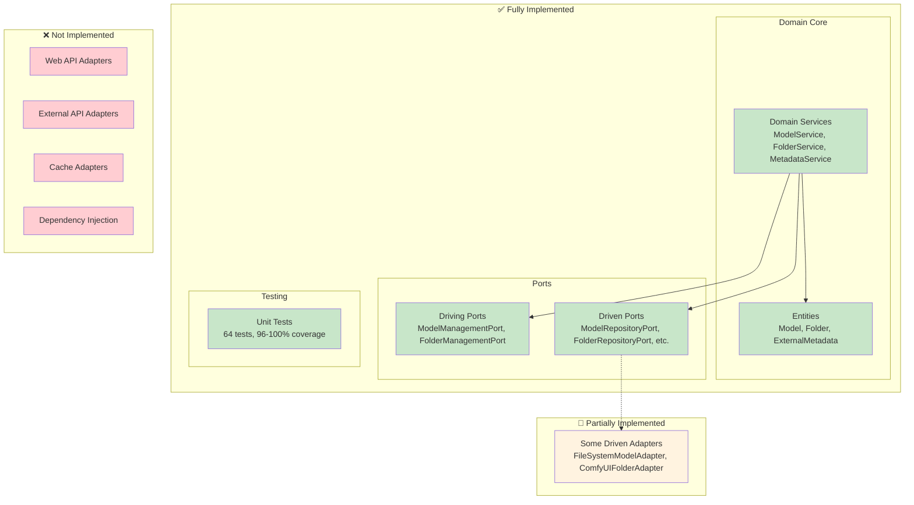

# Current Implementation Status

## Overview

This document provides a detailed overview of the current implementation status of the ComfyUI Asset Manager's hexagonal architecture, including what has been implemented, what's in progress, and what remains to be done.

## Implementation Progress

### ✅ Completed Components

#### Domain Core

**Entities** (100% Complete)
- ✅ `Model` - Core model entity with validation and business methods
- ✅ `Folder` - Core folder entity with hierarchical support
- ✅ `ExternalMetadata` - Value objects for external metadata
- ✅ `CivitAIMetadata` - CivitAI-specific metadata value object
- ✅ `HuggingFaceMetadata` - HuggingFace-specific metadata value object

**Domain Services** (100% Complete)
- ✅ `ModelService` - Business logic for model operations
- ✅ `FolderService` - Business logic for folder operations  
- ✅ `MetadataService` - External metadata enrichment logic

#### Ports

**Driving Ports** (100% Complete)
- ✅ `ModelManagementPort` - Defines model use cases
- ✅ `FolderManagementPort` - Defines folder use cases

**Driven Ports** (100% Complete)
- ✅ `ModelRepositoryPort` - Model data access interface
- ✅ `FolderRepositoryPort` - Folder data access interface
- ✅ `ExternalMetadataPort` - External API access interface
- ✅ `CachePort` - Caching functionality interface

#### Testing

**Unit Tests** (100% Complete)
- ✅ 64 comprehensive unit tests for all domain services
- ✅ 96-100% test coverage for implemented services
- ✅ Mock-based testing following hexagonal architecture principles
- ✅ Edge case and error scenario coverage

### 🚧 Partially Implemented Components

#### Driven Adapters

**File System Adapters** (Partially Complete)
- ✅ `FileSystemModelAdapter` - Basic structure implemented
- ⚠️ Needs completion of core functionality
- ⚠️ Integration with ComfyUI file structure pending

**ComfyUI Integration** (Partially Complete)
- ✅ `ComfyUIFolderAdapter` - Basic structure implemented
- ⚠️ Needs completion of ComfyUI-specific logic
- ⚠️ Integration with ComfyUI's folder management pending

### ❌ Not Yet Implemented

#### Driving Adapters
- ❌ Web API Adapter - HTTP request handling
- ❌ Route registration and endpoint implementation
- ❌ Request/response transformation
- ❌ Error handling and HTTP status codes

#### Driven Adapters
- ❌ External API Adapters (CivitAI, HuggingFace)
- ❌ Cache Adapter implementations
- ❌ Database adapters (if needed)

#### Integration & Wiring
- ❌ Dependency injection container
- ❌ Application startup and configuration
- ❌ Service registration and lifecycle management

## Current Architecture State

### Implemented Layers



## Service Implementation Details

### ModelService

**Implemented Features:**
- ✅ `get_models_in_folder()` - Retrieves models from specific folder with validation
- ✅ `get_model_details()` - Gets detailed model info with optional metadata enrichment
- ✅ `search_models()` - Searches models with optional folder filtering
- ✅ `enrich_model_metadata()` - Enriches models with external metadata

**Key Characteristics:**
- Input validation with meaningful error messages
- Graceful fallback when external services fail
- Integration with MetadataService for enrichment
- Comprehensive error handling

**Test Coverage:** 23 unit tests, 97% coverage

### FolderService

**Implemented Features:**
- ✅ `get_all_folders()` - Retrieves all available folders
- ✅ `get_folder_by_id()` - Gets specific folder by ID with validation
- ✅ `get_folder_structure()` - Returns hierarchical folder structure

**Key Characteristics:**
- Simple, focused implementation
- Proper input validation
- Support for hierarchical folder structures
- Clean error handling

**Test Coverage:** 11 unit tests, 100% coverage

### MetadataService

**Implemented Features:**
- ✅ `enrich_metadata()` - Enriches models with external metadata from multiple sources
- ✅ `get_cached_metadata()` - Retrieves cached metadata with TTL support
- ✅ `clear_cache()` - Clears all cached metadata
- ✅ `invalidate_model_cache()` - Invalidates specific model cache
- ✅ Caching strategy with configurable TTL
- ✅ Support for both CivitAI and HuggingFace metadata sources
- ✅ Graceful fallback when external services are unavailable

**Key Characteristics:**
- Performance optimization through intelligent caching
- Multi-source metadata aggregation
- Robust error handling with graceful degradation
- Configurable cache behavior

**Test Coverage:** 30 unit tests, 96% coverage

## Code Quality Metrics

### Test Coverage Summary
```
Domain Services:        96-100% coverage
Total Unit Tests:       64 tests
Test Execution Time:    ~0.25 seconds
Test Success Rate:      100%
```

### Architecture Compliance
- ✅ All services implement driving ports correctly
- ✅ All services depend only on driven port abstractions
- ✅ No infrastructure dependencies in domain layer
- ✅ Proper separation of concerns maintained
- ✅ Dependency inversion principle followed

### Code Quality
- ✅ Type hints throughout codebase
- ✅ Comprehensive docstrings
- ✅ Consistent error handling patterns
- ✅ Input validation in all public methods
- ✅ Logging for debugging and monitoring

## Next Implementation Steps

### Priority 1: Complete Driven Adapters

1. **FileSystemModelAdapter**
   ```python
   # Complete implementation needed:
   - find_all_in_folder() - Scan ComfyUI model directories
   - find_by_id() - Locate specific model files
   - search() - Search models by name/metadata
   - save() - Update model metadata
   ```

2. **ComfyUIFolderAdapter**
   ```python
   # Complete implementation needed:
   - get_all_folders() - Discover ComfyUI model folders
   - get_folder_structure() - Build hierarchical structure
   - find_by_id() - Locate specific folders
   ```

3. **External API Adapters**
   ```python
   # New implementations needed:
   - CivitAIAdapter(ExternalMetadataPort)
   - HuggingFaceAdapter(ExternalMetadataPort)
   - CacheAdapter(CachePort)
   ```

### Priority 2: Implement Driving Adapters

1. **Web API Adapter**
   ```python
   class WebAPIAdapter:
       def __init__(
           self, 
           model_management: ModelManagementPort,
           folder_management: FolderManagementPort
       ):
           # Implementation needed
   
       async def get_models(self, request) -> web.Response:
           # HTTP request handling
   
       async def get_folders(self, request) -> web.Response:
           # HTTP request handling
   ```

2. **Route Registration**
   ```python
   # Routes to implement:
   GET /asset_manager/folders/{folder_id}/models
   GET /asset_manager/folders/{folder_id}
   GET /asset_manager/folders
   GET /asset_manager/models/{model_id}
   GET /asset_manager/search?q={query}
   ```

### Priority 3: Dependency Injection and Wiring

1. **Application Factory**
   ```python
   def create_application() -> web.Application:
       # Wire up all dependencies
       # Register routes
       # Configure middleware
   ```

2. **Configuration Management**
   ```python
   # Configuration for:
   - ComfyUI paths
   - External API keys
   - Cache settings
   - Logging configuration
   ```

## Development Guidelines

### Adding New Features

When adding new features to the current implementation:

1. **Start with Domain Layer**
   - Add/modify entities if needed
   - Extend domain services with new business logic
   - Update driving ports if new use cases are added

2. **Define Driven Ports**
   - Create new driven ports for external dependencies
   - Keep interfaces focused and cohesive

3. **Implement Adapters**
   - Create driven adapters for infrastructure concerns
   - Implement driving adapters for new interfaces

4. **Write Tests First**
   - Unit tests for domain services using mocks
   - Integration tests for adapters
   - Contract tests for port implementations

### Testing Strategy

**Current Testing Approach:**
```python
# Unit tests use mocks for all dependencies
@pytest.fixture
def mock_model_repository():
    return Mock()

def test_get_models_in_folder(mock_model_repository, sample_model):
    mock_model_repository.find_all_in_folder.return_value = [sample_model]
    service = ModelService(mock_model_repository)
    
    result = service.get_models_in_folder("folder-1")
    
    assert result == [sample_model]
```

**Future Testing Needs:**
- Integration tests for adapters
- End-to-end tests for complete request flows
- Performance tests for caching behavior
- Contract tests for external API integrations

## Architecture Decisions

### Key Design Decisions Made

1. **Port Classification**
   - Management ports (ModelManagementPort, FolderManagementPort) are driving ports
   - Repository ports are driven ports
   - External service ports are driven ports

2. **Service Responsibilities**
   - ModelService handles all model-related business logic
   - FolderService handles folder operations
   - MetadataService is a specialized service for external enrichment

3. **Error Handling Strategy**
   - Domain exceptions (ValidationError, NotFoundError) for business rule violations
   - Graceful fallback for external service failures
   - Comprehensive input validation at service boundaries

4. **Caching Strategy**
   - MetadataService handles caching internally
   - TTL-based cache expiration
   - Cache invalidation methods provided

### Future Architecture Considerations

1. **Event-Driven Architecture**
   - Consider domain events for model updates
   - Potential for async processing of metadata enrichment

2. **CQRS Pattern**
   - Separate read/write models if complexity increases
   - Optimize query performance for large model collections

3. **Microservices**
   - Current monolithic structure could be split if needed
   - Clear port boundaries make service extraction easier

## Conclusion

The current implementation provides a solid foundation with a complete domain layer and comprehensive test coverage. The hexagonal architecture is properly implemented with clear separation of concerns and proper dependency flow. The next phase should focus on completing the adapter implementations to create a fully functional system.

The architecture decisions made support future extensibility and maintainability, making it straightforward to add new features, interfaces, and integrations as the system evolves.