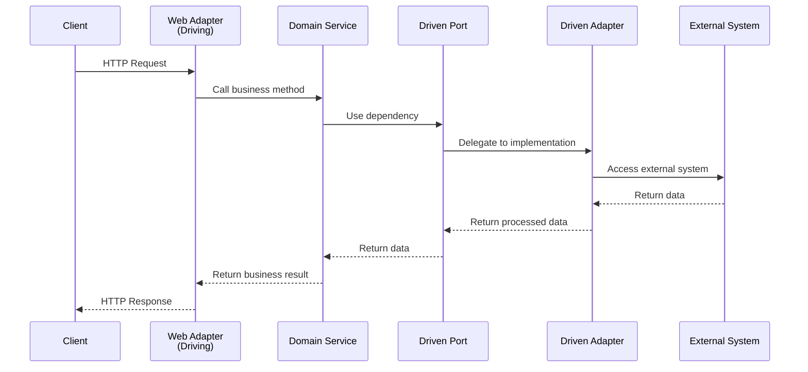

# Developer Guide: Working with Hexagonal Architecture

## Overview

This guide provides practical instructions for developers working with the ComfyUI Asset Manager's hexagonal architecture implementation. It covers common development tasks, patterns, and best practices.

## Table of Contents

1. [Quick Start](#quick-start)
2. [Understanding the Flow](#understanding-the-flow)
3. [Working with Domain Services](#working-with-domain-services)
4. [Implementing Adapters](#implementing-adapters)
5. [Testing Patterns](#testing-patterns)
6. [Common Development Tasks](#common-development-tasks)
7. [Troubleshooting](#troubleshooting)

## Quick Start

### Running Tests

```bash
# Run all domain service tests
poetry run pytest tests/domain/services/ -v

# Run specific service tests
poetry run pytest tests/domain/services/test_model_service.py -v

# Run with coverage
poetry run pytest tests/domain/services/ --cov=src/domain/services --cov-report=html
```

### Project Structure Navigation

```
src/domain/
├── entities/           # Core business objects
│   ├── model.py       # Model entity
│   ├── folder.py      # Folder entity
│   └── external_metadata.py
├── services/          # Business logic
│   ├── model_service.py
│   ├── folder_service.py
│   └── metadata_service.py
└── ports/
    ├── driving/       # What the app can do (use cases)
    │   ├── model_management_port.py
    │   └── folder_management_port.py
    └── driven/        # What the app needs (dependencies)
        ├── model_repository_port.py
        ├── folder_repository_port.py
        ├── external_metadata_port.py
        └── cache_port.py
```

## Understanding the Flow

### Request Processing Flow



### Key Principles to Remember

1. **Dependency Direction**: Always flows inward toward the domain
2. **Port Usage**: Services use driven ports, adapters implement them
3. **Business Logic**: Lives only in domain services and entities
4. **Error Handling**: Domain exceptions for business rules, graceful fallback for infrastructure

## Working with Domain Services

### Using Existing Services

```python
from src.domain.services import ModelService, FolderService, MetadataService
from src.domain.entities.base import ValidationError, NotFoundError

# Example: Using ModelService
def example_usage():
    # Services are injected with their dependencies
    model_service = ModelService(
        model_repository=mock_repository,
        external_metadata_port=mock_metadata_port
    )
    
    try:
        # Business operations
        models = model_service.get_models_in_folder("folder-123")
        model_details = model_service.get_model_details("model-456")
        search_results = model_service.search_models("checkpoint", "folder-123")
        
    except ValidationError as e:
        print(f"Validation error: {e.message} (field: {e.field})")
    except NotFoundError as e:
        print(f"Not found: {e}")
```

### Adding New Business Logic

When adding new business logic, follow this pattern:

1. **Add to Driving Port** (if it's a new use case)
```python
# src/domain/ports/driving/model_management_port.py
@abstractmethod
def batch_update_models(self, updates: List[ModelUpdate]) -> List[Model]:
    """New use case: batch update multiple models"""
    pass
```

2. **Implement in Domain Service**
```python
# src/domain/services/model_service.py
def batch_update_models(self, updates: List[ModelUpdate]) -> List[Model]:
    """Business logic for batch updating models"""
    # Validation
    if not updates:
        raise ValidationError("updates cannot be empty", "updates")
    
    # Business rules
    results = []
    for update in updates:
        # Apply business logic
        model = self._model_repository.find_by_id(update.model_id)
        if model:
            # Update logic here
            updated_model = self._apply_update(model, update)
            self._model_repository.save(updated_model)
            results.append(updated_model)
    
    return results
```

3. **Add Tests**
```python
# tests/domain/services/test_model_service.py
def test_batch_update_models_success(mock_model_repository, sample_updates):
    service = ModelService(mock_model_repository)
    
    result = service.batch_update_models(sample_updates)
    
    assert len(result) == len(sample_updates)
    mock_model_repository.save.assert_called()
```

## Implementing Adapters

### Driven Adapter Pattern

Driven adapters implement driven ports and handle infrastructure concerns:

```python
# Example: Implementing a cache adapter
from src.domain.ports.driven.cache_port import CachePort
from typing import Any, Optional
import redis

class RedisCacheAdapter(CachePort):
    """Driven adapter implementing cache functionality with Redis"""
    
    def __init__(self, redis_url: str):
        self._redis = redis.from_url(redis_url)
    
    def get(self, key: str) -> Optional[Any]:
        """Get value from Redis cache"""
        try:
            data = self._redis.get(key)
            return json.loads(data) if data else None
        except Exception as e:
            # Log error but don't fail - graceful degradation
            logger.warning(f"Cache get failed for key {key}: {e}")
            return None
    
    def set(self, key: str, value: Any, ttl: Optional[int] = None) -> None:
        """Set value in Redis cache"""
        try:
            data = json.dumps(value)
            if ttl:
                self._redis.setex(key, ttl, data)
            else:
                self._redis.set(key, data)
        except Exception as e:
            logger.warning(f"Cache set failed for key {key}: {e}")
    
    # ... implement other methods
```

### Driving Adapter Pattern

Driving adapters translate external requests to domain operations:

```python
# Example: Web API adapter
from aiohttp import web
from src.domain.ports.driving.model_management_port import ModelManagementPort
from src.domain.entities.base import ValidationError, NotFoundError

class ModelWebAdapter:
    """Driving adapter for HTTP requests"""
    
    def __init__(self, model_management: ModelManagementPort):
        self._model_management = model_management
    
    async def get_models_in_folder(self, request: web.Request) -> web.Response:
        """Translate HTTP request to domain operation"""
        try:
            folder_id = request.match_info['folder_id']
            models = self._model_management.get_models_in_folder(folder_id)
            
            return web.json_response({
                "models": [model.to_dict() for model in models],
                "count": len(models)
            })
            
        except ValidationError as e:
            return web.json_response(
                {"error": e.message, "field": e.field}, 
                status=400
            )
        except NotFoundError as e:
            return web.json_response(
                {"error": str(e)}, 
                status=404
            )
        except Exception as e:
            logger.error(f"Unexpected error: {e}")
            return web.json_response(
                {"error": "Internal server error"}, 
                status=500
            )
    
    def register_routes(self, app: web.Application):
        """Register HTTP routes"""
        app.router.add_get(
            '/asset_manager/folders/{folder_id}/models', 
            self.get_models_in_folder
        )
```

## Testing Patterns

### Unit Testing Domain Services

Always use mocks for dependencies in unit tests:

```python
import pytest
from unittest.mock import Mock
from src.domain.services.model_service import ModelService

@pytest.fixture
def mock_model_repository():
    """Mock the driven port dependency"""
    return Mock()

@pytest.fixture
def mock_external_metadata_port():
    """Mock the external metadata dependency"""
    return Mock()

def test_get_models_in_folder_success(mock_model_repository, sample_model):
    """Test successful model retrieval"""
    # Arrange
    mock_model_repository.find_all_in_folder.return_value = [sample_model]
    service = ModelService(mock_model_repository)
    
    # Act
    result = service.get_models_in_folder("folder-1")
    
    # Assert
    assert result == [sample_model]
    mock_model_repository.find_all_in_folder.assert_called_once_with("folder-1")

def test_get_models_in_folder_validation_error(mock_model_repository):
    """Test validation error handling"""
    service = ModelService(mock_model_repository)
    
    with pytest.raises(ValidationError) as exc_info:
        service.get_models_in_folder("")
    
    assert exc_info.value.field == "folder_id"
    assert "cannot be empty" in exc_info.value.message
```

### Integration Testing Adapters

Test adapters against real infrastructure when possible:

```python
import pytest
from src.adapters.driven.redis_cache_adapter import RedisCacheAdapter

@pytest.mark.integration
def test_redis_cache_adapter_integration():
    """Integration test with real Redis instance"""
    cache = RedisCacheAdapter("redis://localhost:6379")
    
    # Test set and get
    cache.set("test_key", {"data": "value"}, ttl=60)
    result = cache.get("test_key")
    
    assert result == {"data": "value"}
    
    # Test expiration
    import time
    time.sleep(61)
    expired_result = cache.get("test_key")
    assert expired_result is None
```

### Contract Testing

Verify that adapters correctly implement their ports:

```python
def test_cache_adapter_implements_port_correctly():
    """Contract test: verify adapter implements port interface"""
    from src.domain.ports.driven.cache_port import CachePort
    from src.adapters.driven.redis_cache_adapter import RedisCacheAdapter
    
    adapter = RedisCacheAdapter("redis://localhost:6379")
    
    # Verify it implements the port
    assert isinstance(adapter, CachePort)
    
    # Verify all methods are implemented
    assert hasattr(adapter, 'get')
    assert hasattr(adapter, 'set')
    assert hasattr(adapter, 'delete')
    assert hasattr(adapter, 'clear')
    assert hasattr(adapter, 'exists')
```

## Common Development Tasks

### Adding a New Entity

1. **Create the entity class**
```python
# src/domain/entities/new_entity.py
from dataclasses import dataclass
from .base import Entity, ValidationError, validate_not_empty

@dataclass
class NewEntity(Entity):
    name: str
    description: str
    
    def __post_init__(self):
        self._validate()
    
    def _validate(self) -> None:
        validate_not_empty(self.name, "name")
        validate_not_empty(self.description, "description")
    
    def to_dict(self) -> Dict[str, Any]:
        return {
            "id": self.id,
            "name": self.name,
            "description": self.description
        }
```

2. **Add to entities __init__.py**
```python
# src/domain/entities/__init__.py
from .new_entity import NewEntity

__all__ = [..., "NewEntity"]
```

3. **Write entity tests**
```python
# tests/domain/entities/test_new_entity.py
def test_new_entity_creation():
    entity = NewEntity(id="1", name="Test", description="Test desc")
    assert entity.name == "Test"

def test_new_entity_validation():
    with pytest.raises(ValidationError):
        NewEntity(id="1", name="", description="Test")
```

### Adding a New Use Case

1. **Add to driving port**
2. **Implement in domain service**
3. **Add driven port if needed**
4. **Write comprehensive tests**
5. **Update adapters to expose the use case**

### Adding External Integration

1. **Define driven port interface**
```python
# src/domain/ports/driven/new_external_port.py
class NewExternalPort(ABC):
    @abstractmethod
    def fetch_data(self, identifier: str) -> Optional[ExternalData]:
        pass
```

2. **Implement adapter**
```python
# src/adapters/driven/new_external_adapter.py
class NewExternalAdapter(NewExternalPort):
    def fetch_data(self, identifier: str) -> Optional[ExternalData]:
        # Implementation with error handling
        pass
```

3. **Integrate with domain service**
4. **Add comprehensive tests**

## Troubleshooting

### Common Issues

**Issue: Circular imports**
```python
# ❌ Wrong - importing concrete classes
from src.adapters.driven.file_adapter import FileAdapter

# ✅ Correct - importing port interfaces
from src.domain.ports.driven.model_repository_port import ModelRepositoryPort
```

**Issue: Business logic in adapters**
```python
# ❌ Wrong - business logic in adapter
class WebAdapter:
    def get_models(self, request):
        folder_id = request.match_info['folder_id']
        if not folder_id:  # Business validation in adapter
            return web.json_response({"error": "Invalid folder"}, status=400)

# ✅ Correct - delegate to domain service
class WebAdapter:
    def get_models(self, request):
        folder_id = request.match_info['folder_id']
        try:
            models = self._model_service.get_models_in_folder(folder_id)
            return web.json_response({"models": [m.to_dict() for m in models]})
        except ValidationError as e:
            return web.json_response({"error": e.message}, status=400)
```

**Issue: Infrastructure dependencies in domain**
```python
# ❌ Wrong - importing infrastructure in domain
from redis import Redis  # Infrastructure import in domain

# ✅ Correct - use port abstraction
from src.domain.ports.driven.cache_port import CachePort
```

### Debugging Tips

1. **Check dependency flow**: Ensure dependencies flow inward toward domain
2. **Verify port implementations**: Make sure adapters implement all port methods
3. **Test in isolation**: Use mocks to isolate components during testing
4. **Check error handling**: Ensure graceful fallback for infrastructure failures

### Performance Considerations

1. **Caching**: Use MetadataService caching for expensive external calls
2. **Batch operations**: Implement batch methods for bulk operations
3. **Lazy loading**: Consider lazy loading for expensive operations
4. **Connection pooling**: Use connection pools in adapters for external services

## Best Practices

### Do's
- ✅ Keep business logic in domain services
- ✅ Use dependency injection for all dependencies
- ✅ Write tests for all business logic
- ✅ Handle errors gracefully with appropriate exceptions
- ✅ Use meaningful names for ports and adapters
- ✅ Keep adapters thin - delegate to domain services

### Don'ts
- ❌ Don't put business logic in adapters
- ❌ Don't import infrastructure code in domain layer
- ❌ Don't skip input validation in domain services
- ❌ Don't let infrastructure failures crash the application
- ❌ Don't create circular dependencies between layers
- ❌ Don't test infrastructure in unit tests

## Conclusion

The hexagonal architecture provides a robust foundation for building maintainable applications. By following these patterns and practices, you can extend the system while maintaining architectural integrity and ensuring high code quality.

Remember: the key to success with hexagonal architecture is understanding the flow of dependencies and maintaining clear boundaries between layers. When in doubt, ask yourself: "Does this belong in the domain, or is it an infrastructure concern?"