# Hexagonal Architecture Implementation

## Overview

This document provides a comprehensive explanation of how the ComfyUI Asset Manager implements the Hexagonal Architecture (also known as Ports and Adapters pattern). This architecture ensures clean separation of concerns, testability, and flexibility by isolating business logic from infrastructure concerns.

## Table of Contents

1. [Architecture Principles](#architecture-principles)
2. [Layer Breakdown](#layer-breakdown)
3. [Port Classification](#port-classification)
4. [Implementation Flow](#implementation-flow)
5. [Visual Architecture Diagrams](#visual-architecture-diagrams)
6. [Code Examples](#code-examples)
7. [Benefits and Trade-offs](#benefits-and-trade-offs)

## Architecture Principles

### Core Concepts

The hexagonal architecture is built on several key principles:

1. **Dependency Inversion**: High-level modules (domain) don't depend on low-level modules (infrastructure). Both depend on abstractions (ports).

2. **Isolation of Business Logic**: The domain core contains pure business logic without any infrastructure dependencies.

3. **Testability**: Business logic can be tested in complete isolation using mock implementations of ports.

4. **Flexibility**: Infrastructure components can be swapped without affecting business logic.

### The Hexagon Metaphor


## Layer Breakdown

### 1. Domain Core (Center of Hexagon)

The domain core contains the essential business logic and is completely independent of external concerns.

#### Entities
- **Purpose**: Core business objects with identity and behavior
- **Examples**: `Model`, `Folder`, `ExternalMetadata`
- **Characteristics**: 
  - Contain business rules and validation
  - Have unique identity
  - Encapsulate business behavior

#### Value Objects
- **Purpose**: Immutable objects that describe aspects of the domain
- **Examples**: `CivitAIMetadata`, `HuggingFaceMetadata`
- **Characteristics**:
  - Immutable (frozen dataclasses)
  - No identity (equality based on values)
  - Represent descriptive aspects

#### Domain Services
- **Purpose**: Business logic that doesn't naturally fit in entities
- **Examples**: `ModelService`, `FolderService`, `MetadataService`
- **Characteristics**:
  - Implement driving ports
  - Orchestrate business operations
  - Use driven ports for dependencies

### 2. Ports (Interfaces)

Ports define the boundaries of the application and establish contracts for interaction.

#### Driving Ports (Primary/Left-side)
- **Purpose**: Define what the application can do
- **Direction**: External world → Application
- **Implementation**: Domain services implement these ports
- **Usage**: Driving adapters use these ports

#### Driven Ports (Secondary/Right-side)
- **Purpose**: Define what the application needs
- **Direction**: Application → External world
- **Implementation**: Driven adapters implement these ports
- **Usage**: Domain services use these ports

### 3. Adapters (Infrastructure)

Adapters handle the translation between the external world and the application core.

#### Driving Adapters (Primary)
- **Purpose**: Translate external requests to domain operations
- **Examples**: Web API controllers, CLI handlers
- **Flow**: External request → Adapter → Driving Port → Domain Service

#### Driven Adapters (Secondary)
- **Purpose**: Implement infrastructure concerns
- **Examples**: Database repositories, external API clients, file system handlers
- **Flow**: Domain Service → Driven Port → Adapter → External System

## Port Classification

Understanding the distinction between driving and driven ports is crucial for proper architecture implementation.

### Driving Ports: "What the Application Can Do"

These ports represent the **use cases** that external actors want to trigger. They define the application's public API.

```python
# Example: ModelManagementPort (Driving Port)
class ModelManagementPort(ABC):
    """Defines what the application can do with models"""
    
    @abstractmethod
    def get_models_in_folder(self, folder_id: str) -> List[Model]:
        """Use case: Get models in a folder"""
        pass
    
    @abstractmethod
    def search_models(self, query: str) -> List[Model]:
        """Use case: Search for models"""
        pass
```

**Key Characteristics:**
- Represent business use cases
- Implemented by domain services
- Used by driving adapters (Web API, CLI, etc.)
- Define the application's capabilities

### Driven Ports: "What the Application Needs"

These ports represent the **dependencies** that the application requires to fulfill its use cases.

```python
# Example: ModelRepositoryPort (Driven Port)
class ModelRepositoryPort(ABC):
    """Defines what the application needs for model persistence"""
    
    @abstractmethod
    def find_all_in_folder(self, folder_id: str) -> List[Model]:
        """Dependency: Need to find models in storage"""
        pass
    
    @abstractmethod
    def save(self, model: Model) -> None:
        """Dependency: Need to persist models"""
        pass
```

**Key Characteristics:**
- Represent infrastructure dependencies
- Implemented by driven adapters
- Used by domain services
- Define what the application needs from the outside world

## Implementation Flow

### Request Flow Through the Architecture


### Dependency Flow


## Visual Architecture Diagrams

### Complete System Architecture

```mermaid
graph TB
    subgraph "Driving Side (Primary)"
        WebAPI[Web API<br/>aiohttp routes]
        CLI[CLI Interface<br/>Future]
        
        subgraph "Driving Adapters"
            WebAdapter[Web API Adapter<br/>Route handlers]
            CLIAdapter[CLI Adapter<br/>Command handlers]
        end
        
        subgraph "Driving Ports"
            ModelMgmtPort[ModelManagementPort<br/>• get_models_in_folder<br/>• get_model_details<br/>• search_models<br/>• enrich_model_metadata]
            FolderMgmtPort[FolderManagementPort<br/>• get_all_folders<br/>• get_folder_by_id<br/>• get_folder_structure]
        end
    end
    
    subgraph "Domain Core"
        subgraph "Domain Services"
            ModelService[ModelService<br/>Business logic for<br/>model operations]
            FolderService[FolderService<br/>Business logic for<br/>folder operations]
            MetadataService[MetadataService<br/>External metadata<br/>enrichment logic]
        end
        
        subgraph "Entities"
            Model[Model<br/>Core model entity]
            Folder[Folder<br/>Core folder entity]
            ExtMetadata[ExternalMetadata<br/>Value objects]
        end
    end
    
    subgraph "Driven Side (Secondary)"
        subgraph "Driven Ports"
            ModelRepoPort[ModelRepositoryPort<br/>• find_all_in_folder<br/>• find_by_id<br/>• search<br/>• save]
            FolderRepoPort[FolderRepositoryPort<br/>• get_all_folders<br/>• get_folder_structure<br/>• find_by_id]
            ExtMetadataPort[ExternalMetadataPort<br/>• fetch_metadata<br/>• fetch_civitai_metadata<br/>• fetch_huggingface_metadata]
            CachePort[CachePort<br/>• get<br/>• set<br/>• delete<br/>• clear]
        end
        
        subgraph "Driven Adapters"
            FileSystemAdapter[FileSystem Adapter<br/>Scans ComfyUI folders]
            ComfyUIAdapter[ComfyUI Folder Adapter<br/>Integrates with ComfyUI]
            CivitAIAdapter[CivitAI Adapter<br/>External API client]
            HuggingFaceAdapter[HuggingFace Adapter<br/>External API client]
            CacheAdapter[Cache Adapter<br/>In-memory/Redis cache]
        end
        
        subgraph "External Systems"
            ComfyUIFS[ComfyUI File System<br/>Model directories]
            CivitAI[CivitAI API<br/>External metadata]
            HuggingFace[HuggingFace API<br/>External metadata]
            CacheSystem[Cache System<br/>Redis/Memory]
        end
    end
    
    %% Driving side connections
    WebAPI --> WebAdapter
    CLI --> CLIAdapter
    WebAdapter --> ModelMgmtPort
    WebAdapter --> FolderMgmtPort
    CLIAdapter --> ModelMgmtPort
    CLIAdapter --> FolderMgmtPort
    
    %% Port to service connections
    ModelMgmtPort --> ModelService
    FolderMgmtPort --> FolderService
    
    %% Service to entity connections
    ModelService --> Model
    FolderService --> Folder
    MetadataService --> ExtMetadata
    
    %% Service to driven port connections
    ModelService --> ModelRepoPort
    ModelService --> ExtMetadataPort
    FolderService --> FolderRepoPort
    MetadataService --> ExtMetadataPort
    MetadataService --> CachePort
    
    %% Driven port to adapter connections
    ModelRepoPort --> FileSystemAdapter
    ModelRepoPort --> ComfyUIAdapter
    FolderRepoPort --> ComfyUIAdapter
    ExtMetadataPort --> CivitAIAdapter
    ExtMetadataPort --> HuggingFaceAdapter
    CachePort --> CacheAdapter
    
    %% Adapter to external system connections
    FileSystemAdapter --> ComfyUIFS
    ComfyUIAdapter --> ComfyUIFS
    CivitAIAdapter --> CivitAI
    HuggingFaceAdapter --> HuggingFace
    CacheAdapter --> CacheSystem
    
    %% Styling
    classDef drivingPort fill:#e1f5fe,stroke:#01579b,stroke-width:2px
    classDef drivenPort fill:#fff3e0,stroke:#e65100,stroke-width:2px
    classDef domainService fill:#e8f5e8,stroke:#2e7d32,stroke-width:2px
    classDef entity fill:#f3e5f5,stroke:#7b1fa2,stroke-width:2px
    classDef adapter fill:#fafafa,stroke:#424242,stroke-width:1px
    
    class ModelMgmtPort,FolderMgmtPort drivingPort
    class ModelRepoPort,FolderRepoPort,ExtMetadataPort,CachePort drivenPort
    class ModelService,FolderService,MetadataService domainService
    class Model,Folder,ExtMetadata entity
    class WebAdapter,CLIAdapter,FileSystemAdapter,ComfyUIAdapter,CivitAIAdapter,HuggingFaceAdapter,CacheAdapter adapter
```



### Service Dependencies and Interactions

```mermaid
graph TB
    subgraph "Domain Services Layer"
        ModelService[ModelService]
        FolderService[FolderService]
        MetadataService[MetadataService]
    end
    
    subgraph "Driving Ports (What app can do)"
        ModelMgmtPort[ModelManagementPort<br/>📤 Use Cases]
        FolderMgmtPort[FolderManagementPort<br/>📤 Use Cases]
    end
    
    subgraph "Driven Ports (What app needs)"
        ModelRepoPort[ModelRepositoryPort<br/>📥 Data Access]
        FolderRepoPort[FolderRepositoryPort<br/>📥 Data Access]
        ExtMetadataPort[ExternalMetadataPort<br/>📥 External APIs]
        CachePort[CachePort<br/>📥 Caching]
    end
    
    %% Services implement driving ports
    ModelService -.->|implements| ModelMgmtPort
    FolderService -.->|implements| FolderMgmtPort
    
    %% Services use driven ports
    ModelService -->|uses| ModelRepoPort
    ModelService -->|uses| ExtMetadataPort
    FolderService -->|uses| FolderRepoPort
    MetadataService -->|uses| ExtMetadataPort
    MetadataService -->|uses| CachePort
    
    %% Service interactions
    ModelService -->|uses| MetadataService
    
    %% Styling
    classDef service fill:#e8f5e8,stroke:#2e7d32,stroke-width:2px
    classDef drivingPort fill:#e1f5fe,stroke:#01579b,stroke-width:2px
    classDef drivenPort fill:#fff3e0,stroke:#e65100,stroke-width:2px
    
    class ModelService,FolderService,MetadataService service
    class ModelMgmtPort,FolderMgmtPort drivingPort
    class ModelRepoPort,FolderRepoPort,ExtMetadataPort,CachePort drivenPort
```



## Code Examples

### Domain Service Implementation

```python
class ModelService(ModelManagementPort):
    """Domain service implementing the driving port"""
    
    def __init__(
        self,
        model_repository: ModelRepositoryPort,  # Driven port dependency
        external_metadata_port: Optional[ExternalMetadataPort] = None
    ):
        self._model_repository = model_repository
        self._external_metadata_port = external_metadata_port
    
    def get_models_in_folder(self, folder_id: str) -> List[Model]:
        """Business logic for getting models in a folder"""
        # Input validation (business rule)
        if not folder_id or not folder_id.strip():
            raise ValidationError("folder_id cannot be empty", "folder_id")
        
        # Delegate to infrastructure through driven port
        return self._model_repository.find_all_in_folder(folder_id.strip())
    
    def get_model_details(self, model_id: str) -> Model:
        """Business logic for getting detailed model information"""
        # Validation and business rules
        if not model_id or not model_id.strip():
            raise ValidationError("model_id cannot be empty", "model_id")
        
        # Get model from repository
        model = self._model_repository.find_by_id(model_id.strip())
        if model is None:
            raise NotFoundError("Model", model_id)
        
        # Business logic: enrich with external metadata if available
        if self._external_metadata_port:
            try:
                return self.enrich_model_metadata(model)
            except Exception:
                # Graceful fallback - business rule
                pass
        
        return model
```

### Adapter Implementation

```python
class WebAPIAdapter:
    """Driving adapter that translates HTTP requests to domain operations"""
    
    def __init__(self, model_management: ModelManagementPort):
        self._model_management = model_management  # Uses driving port
    
    async def get_models(self, request):
        """Translate HTTP request to domain operation"""
        try:
            folder_id = request.match_info['folder_id']
            models = self._model_management.get_models_in_folder(folder_id)
            return web.json_response([model.to_dict() for model in models])
        except ValidationError as e:
            return web.json_response(
                {"error": e.message, "field": e.field}, 
                status=400
            )
        except NotFoundError as e:
            return web.json_response(
                {"error": str(e)}, 
                status=404
            )

class FileSystemModelAdapter(ModelRepositoryPort):
    """Driven adapter that implements repository port"""
    
    def find_all_in_folder(self, folder_id: str) -> List[Model]:
        """Infrastructure-specific implementation"""
        folder_path = self._get_folder_path(folder_id)
        model_files = self._scan_directory(folder_path)
        return [self._create_model_from_file(file) for file in model_files]
```

### Dependency Injection

```python
def create_application():
    """Wire up the application dependencies"""
    
    # Create driven adapters (infrastructure)
    model_repository = FileSystemModelAdapter(base_path="/path/to/models")
    folder_repository = ComfyUIFolderAdapter()
    civitai_client = CivitAIAdapter(api_key="...")
    cache = InMemoryCacheAdapter()
    
    # Create domain services
    metadata_service = MetadataService(
        civitai_port=civitai_client,
        cache_port=cache
    )
    
    model_service = ModelService(
        model_repository=model_repository,
        external_metadata_port=civitai_client
    )
    
    folder_service = FolderService(
        folder_repository=folder_repository
    )
    
    # Create driving adapters
    web_adapter = WebAPIAdapter(
        model_management=model_service,
        folder_management=folder_service
    )
    
    return web_adapter
```

## Benefits and Trade-offs

### Benefits

1. **Testability**
   - Domain services can be tested in complete isolation
   - Mock implementations of ports enable fast, reliable unit tests
   - No need for databases or external services in unit tests

2. **Flexibility**
   - Infrastructure components can be swapped without changing business logic
   - Easy to support multiple databases, APIs, or interfaces
   - Gradual migration of infrastructure components

3. **Maintainability**
   - Clear separation of concerns
   - Business logic is centralized and protected from infrastructure changes
   - Dependencies are explicit and well-defined

4. **Independence**
   - Domain logic doesn't depend on frameworks, databases, or external services
   - Business rules are preserved regardless of technology changes
   - Easier to reason about and modify business logic

### Trade-offs

1. **Complexity**
   - More interfaces and abstractions to manage
   - Steeper learning curve for developers unfamiliar with the pattern
   - More files and structure to navigate

2. **Initial Development Overhead**
   - More upfront design and planning required
   - Need to think about port design before implementation
   - More boilerplate code for interfaces

3. **Over-engineering Risk**
   - Can be overkill for simple applications
   - May introduce unnecessary abstraction layers
   - Requires discipline to maintain architectural boundaries

### When to Use Hexagonal Architecture

**Good fit for:**
- Complex business logic that needs to be preserved
- Applications with multiple interfaces (Web, CLI, API)
- Systems that integrate with multiple external services
- Long-lived applications that will evolve over time
- Teams that value testability and maintainability

**Consider alternatives for:**
- Simple CRUD applications
- Prototypes or short-lived projects
- Applications with minimal business logic
- Small teams with limited architectural experience

## Conclusion

The hexagonal architecture provides a robust foundation for building maintainable, testable, and flexible applications. By clearly separating business logic from infrastructure concerns through well-defined ports and adapters, we create systems that can evolve and adapt to changing requirements while preserving the core business value.

The key insight is understanding the distinction between driving ports (what the application can do) and driven ports (what the application needs), which enables proper dependency flow and maintains the architectural integrity of the system.